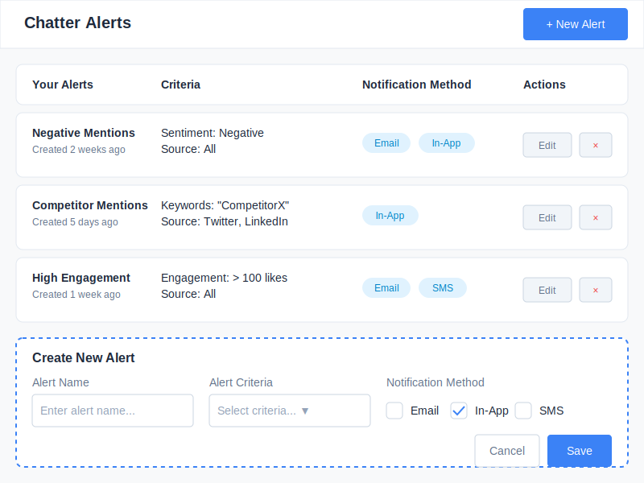

# Chatter Monitor Alerts Wireframe

## Wireframe Documentation

### Change Log

| Date | Description | Change Type |
|------|-------------|-------------|
| 2023-10-17 | Initial wireframe creation for Chatter Monitor alerts configuration | AI-generated based on user requirements |

### Current Version

### Description

This wireframe illustrates the alerts configuration screen for the Chatter Monitor feature, which allows users to set up custom notifications for specific mention criteria. The alerts screen includes:

1. **Header** - With the title "Chatter Alerts" and a "+ New Alert" button
2. **Alerts List** - Displaying existing configured alerts with their criteria and notification methods
3. **Alert Creation Form** - Interface for creating new alerts with name, criteria, and notification preferences

### Key Components

- **New Alert Button**: Prominent button to initiate the creation of a new alert
- **Alerts List**: Each alert entry shows:
  - Alert name and creation date
  - Alert criteria (sentiment, keywords, sources, engagement thresholds)
  - Notification methods (Email, In-App, SMS)
  - Action buttons (Edit, Delete)
- **Alert Creation Form**: Form with fields for:
  - Alert name input
  - Criteria selection dropdown
  - Notification method checkboxes
  - Save and Cancel buttons

### User Interactions

- Users can view all their configured alerts at a glance
- Users can quickly add new alerts with custom criteria
- Each alert can be edited or deleted as needed
- Multiple notification methods can be selected for each alert
- The interface supports various alert criteria types (sentiment-based, keyword-based, engagement-based)
