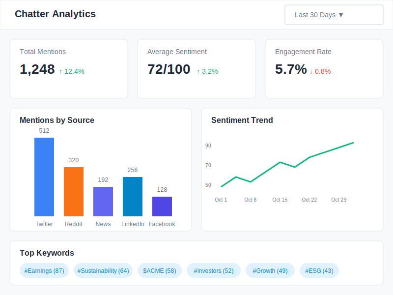

# Chatter Monitor Analytics Wireframe

## Wireframe Documentation

### Change Log

| Date | Description | Change Type |
|------|-------------|-------------|
| 2023-10-16 | Initial wireframe creation for Chatter Monitor analytics view | AI-generated based on user requirements |

### Current Version

### Description

This wireframe illustrates the analytics view of the Chatter Monitor feature, providing detailed metrics and visualizations of company mentions across multiple platforms. The analytics view includes:

1. **Header** - With the title "Chatter Analytics" and a date range selector
2. **Key Metrics Cards** - Displaying Total Mentions, Average Sentiment, and Engagement Rate
3. **Mentions by Source Chart** - Bar chart showing the distribution of mentions across different platforms
4. **Sentiment Trend Chart** - Line chart showing sentiment score trends over time
5. **Top Keywords** - Most frequently mentioned keywords, hashtags, and cashtags

### Key Components

- **Date Range Selector**: Dropdown to select the time period for analysis (Last 30 Days in this example)
- **Key Metrics Cards**: Each with current value, percent change indicator (up/down arrow), and trend direction
- **Mentions by Source Chart**: Bar chart with color-coded bars for each platform and mention count labels
- **Sentiment Trend Chart**: Line chart showing sentiment score evolution over the selected time period
- **Top Keywords Section**: Pills displaying the most frequent keywords with their occurrence count

### Analytics Insights

- The metrics show a 12.4% increase in total mentions and a 3.2% improvement in sentiment score
- Twitter is the dominant source of mentions, followed by Reddit and LinkedIn
- Sentiment has been trending upward over the month, with a slight dip mid-month
- Earnings-related keywords and sustainability topics are prominent in the mentions
