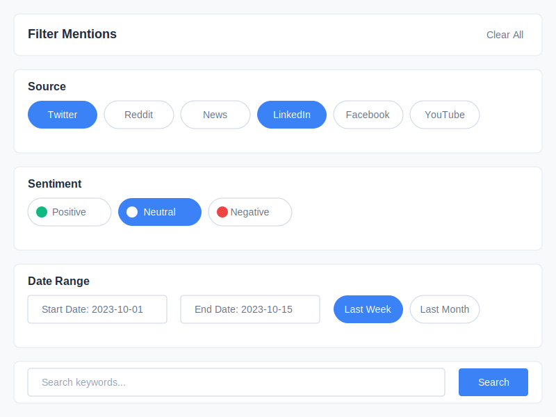

# Chatter Monitor Filter Panel Wireframe

## Wireframe Documentation

### Change Log

| Date | Description | Change Type |
|------|-------------|-------------|
| 2023-10-16 | Initial wireframe creation for Chatter Monitor filter panel | AI-generated based on user requirements |

### Current Version

### Description

This wireframe illustrates the filter panel for the Chatter Monitor dashboard, which allows users to refine the mentions displayed based on various criteria. The filter panel includes:

1. **Panel Header** - With the title "Filter Mentions" and a "Clear All" option to reset filters
2. **Source Filter** - For filtering mentions by platform (Twitter, Reddit, News, LinkedIn, Facebook, YouTube)
3. **Sentiment Filter** - For filtering mentions by sentiment (Positive, Neutral, Negative)
4. **Date Range Filter** - For filtering mentions by date, with both custom date inputs and preset options
5. **Keyword Search** - For searching specific terms within mentions

### Key Components

- **Source Filter Buttons**: Toggle buttons for each platform source, with selected sources highlighted in blue
- **Sentiment Filter Buttons**: Toggle buttons for sentiment categories, with color indicators (green for positive, blue for neutral, red for negative)
- **Date Range Inputs**: Text fields for entering custom start and end dates
- **Preset Date Ranges**: Quick-select buttons for common time periods (Last Week, Last Month)
- **Keyword Search**: Search field with a dedicated search button
- **Clear All Option**: Button to reset all filters to their default state
