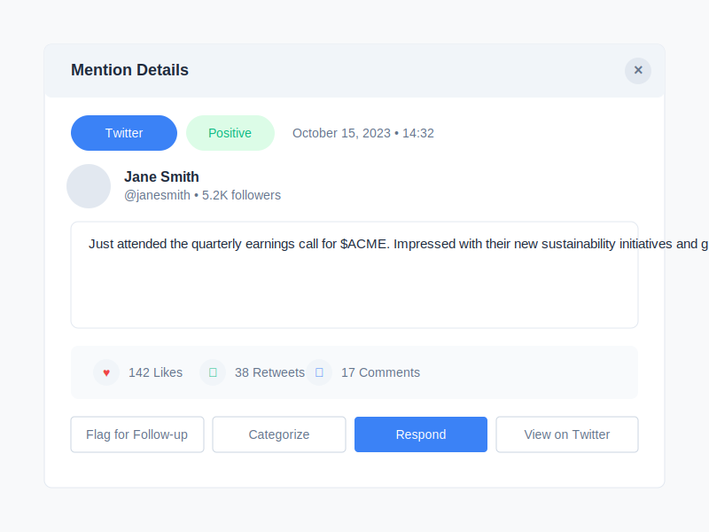

# Chatter Monitor Mention Details Wireframe

## Wireframe Documentation

### Change Log

| Date | Description | Change Type |
|------|-------------|-------------|
| 2023-10-16 | Initial wireframe creation for Chatter Monitor mention details modal | AI-generated based on user requirements |

### Current Version

### Description

This wireframe illustrates the mention details modal in the Chatter Monitor feature, which appears when a user clicks on a specific mention to view more information. The modal includes:

1. **Modal Header** - With the title "Mention Details" and a close button
2. **Source & Sentiment Information** - Displaying the platform source and sentiment classification
3. **Date/Time** - When the mention was posted
4. **Author Information** - Profile picture, name, handle, and follower count
5. **Mention Content** - The full text of the mention
6. **Engagement Metrics** - Likes, retweets/shares, and comments
7. **Action Buttons** - Options to flag, categorize, respond to, or view the original mention

### Key Components

- **Source Badge**: Platform-specific label (Twitter in this example) with appropriate branding color
- **Sentiment Badge**: Color-coded sentiment indicator (green for positive, yellow for neutral, red for negative)
- **Author Profile**: Compact display of the author's identity and social reach
- **Mention Content**: Full text of the mention with hashtags and cashtags preserved
- **Engagement Metrics**: Visual representation of the mention's social engagement
- **Action Buttons**: Contextual actions that can be taken on this specific mention
  - Flag for Follow-up: Mark the mention for later attention
  - Categorize: Assign the mention to specific categories for reporting
  - Respond: Open an interface to reply to the mention (platform permitting)
  - View on Twitter: Open the original mention in its native platform
