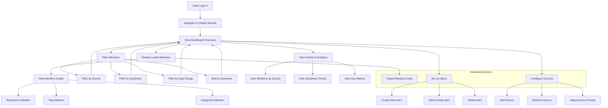

# Chatter Monitor User Flow

## User Flow Documentation

### Change Log

| Date | Description | Change Type |
|------|-------------|-------------|
| 2023-10-15 | Initial user flow diagram for Chatter Monitor feature | AI-generated based on user requirements |

### Current Version

### Description

This diagram illustrates the user flow for the Chatter Monitor feature, which allows companies to track and manage mentions across multiple platforms.

### Key User Paths

1. **Dashboard Overview**: Upon navigating to Chatter Monitor, users see a dashboard with key metrics, charts, and recent mentions.

2. **Filtering Mentions**: Users can filter the displayed mentions by:
   - Source platform (Twitter, Reddit, News, etc.)
   - Sentiment (Positive, Neutral, Negative)
   - Date range
   - Keyword search

3. **Viewing Analytics**: Users can analyze mention data through:
   - Mentions by Source chart
   - Sentiment Trend chart
   - Key metrics (Total Mentions, Sentiment Score, Engagement Rate)

4. **Managing Mentions**: For individual mentions, users can:
   - View full details
   - Respond directly (platform permitting)
   - Flag for follow-up
   - Categorize for reporting

5. **Advanced Actions**:
   - Export mentions data for external analysis
   - Set up alerts for specific mention criteria
   - Configure which sources to monitor and their priority

### User Personas

- **IR Team Member**: Primarily monitors sentiment and responds to investor questions
- **Marketing Manager**: Focuses on brand mentions and engagement metrics
- **PR Specialist**: Monitors news mentions and manages crisis communications
- **Executive**: Reviews high-level metrics and sentiment trends
