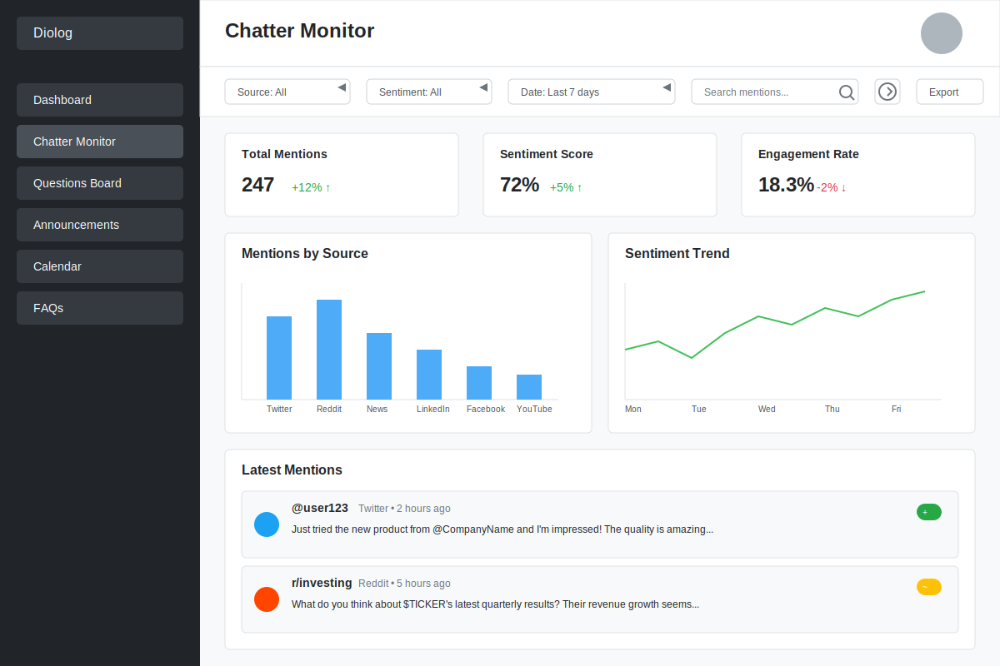

# Company Chatter Monitor Wireframe

## Wireframe Documentation

### Change Log

| Date | Description | Change Type |
|------|-------------|-------------|
| 2023-10-15 | Initial wireframe creation for Chatter Monitor dashboard | AI-generated based on user requirements |

### Current Version

### Description

This wireframe illustrates the Chatter Monitor dashboard, which allows companies to track mentions across multiple platforms. The dashboard includes:

1. **Navigation Sidebar** - With the Chatter Monitor option highlighted
2. **Filter Bar** - For filtering by source, sentiment, and date range
3. **Stats Cards** - Showing key metrics (Total Mentions, Sentiment Score, Engagement Rate)
4. **Charts** - Visualizing mentions by source and sentiment trends
5. **Latest Mentions** - Displaying recent mentions from various platforms with sentiment indicators

### Key Components

- **Source Filter**: Allows filtering mentions by platform (Twitter, Reddit, News, LinkedIn, Facebook, YouTube)
- **Sentiment Filter**: Filters mentions by sentiment (Positive, Neutral, Negative)
- **Date Range Filter**: Controls the time period for displayed mentions
- **Search Bar**: Enables searching within mentions
- **Export Button**: For exporting mention data
- **Mentions by Source Chart**: Bar chart showing volume of mentions by platform
- **Sentiment Trend Chart**: Line chart showing sentiment trends over time
- **Latest Mentions Section**: Chronological list of recent mentions with source and sentiment indicators
