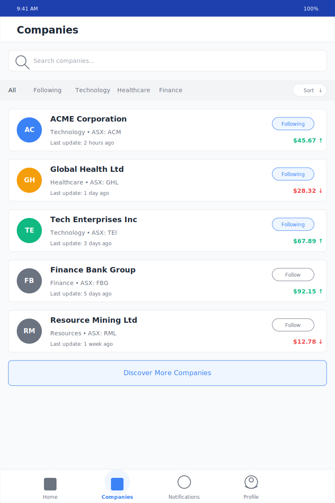

# Diolog Companies Tab Wireframe

## Change Log

| Date | Description | Change Type |
|------|-------------|-------------|
| 2023-10-19 | Initial Companies Tab wireframe creation | AI-generated based on PRD requirements |

## Current Version

## Description

The Companies Tab wireframe represents the screen where users can view and manage the list of companies they are following in the Diolog Mobile App. This screen allows users to discover new companies, follow/unfollow companies, and quickly access company information. The design follows the established color palette and typography guidelines to ensure visual coherence across the application.

## Key Components

1. **Header**
   - Simple header with the title "Companies"
   - Provides clear context for the current screen

2. **Search Bar**
   - Positioned below the header for easy access
   - Allows users to search for specific companies by name, ticker symbol, or industry
   - Includes search icon for visual clarity

3. **Filter Bar**
   - Allows filtering companies by category (All, Following, Technology, Healthcare, Finance, etc.)
   - Includes a sort button to arrange companies by different criteria (e.g., alphabetical, recent activity)
   - Positioned below the search bar for easy access

4. **Company List**
   - Displays companies as interactive cards with key information:
     - Company avatar with initials
     - Company name and industry
     - Stock ticker symbol
     - Current stock price with trend indicator (up/down arrow)
     - Last update timestamp
     - Following status (Following badge or Follow button)
   - Each company card is tappable to access the Company Conversation View

5. **Following/Follow Buttons**
   - "Following" badge for companies the user is already following
   - "Follow" button for companies the user is not yet following
   - Allows easy management of followed companies

6. **Discover More Button**
   - Prominent button at the bottom of the list
   - Encourages users to discover and follow additional companies

7. **Navigation Bar**
   - Fixed at the bottom of the screen
   - Four main tabs: Home, Companies (active), Notifications, and Profile
   - Visual indicators for the active tab

## User Interactions

1. **Tapping a company card** navigates to the Company Conversation View for that specific company
2. **Tapping the search bar** activates the search functionality
3. **Tapping filter options** changes the displayed companies to show only the selected category
4. **Tapping the sort button** opens sorting options (alphabetical, recent activity, etc.)
5. **Tapping "Follow" button** adds the company to the user's followed companies list
6. **Tapping "Following" badge** opens options to unfollow or manage notifications for that company
7. **Tapping "Discover More Companies"** navigates to a company discovery screen
8. **Tapping navigation tabs** switches between different main sections of the app

## Design Notes

- Uses the primary blue (#1E40AF) for the status bar
- Secondary blue (#3B82F6) for following companies' avatars and interactive elements
- Accent colors for different company avatars to create visual distinction
- White background with subtle gray borders for company cards to create visual separation
- Green and red colors for stock price indicators (up/down)
- Consistent typography using the Inter font family
- Consistent spacing and border radius across all elements