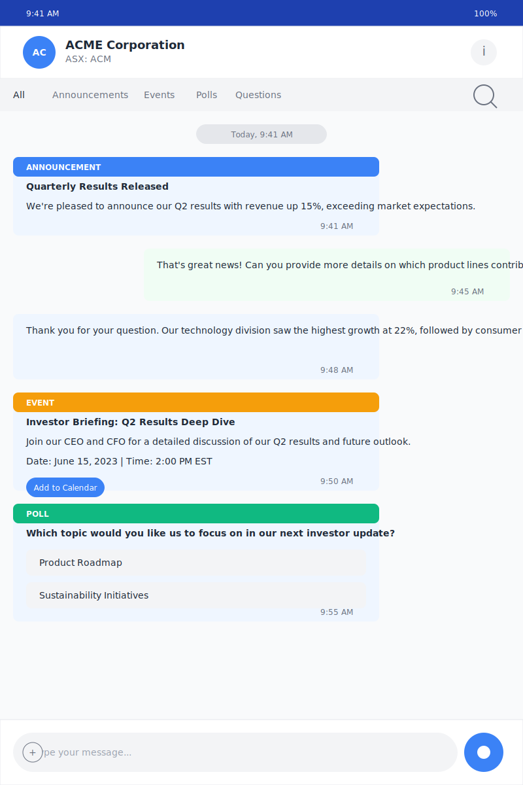

# Diolog Company Conversation View Wireframe

## Change Log

| Date | Description | Change Type |
|------|-------------|-------------|
| 2023-10-19 | Initial Company Conversation View wireframe creation | AI-generated based on PRD requirements |

## Current Version

## Description

The Company Conversation View wireframe represents the chat-style interaction screen between investors and companies in the Diolog Mobile App. This screen is a core functionality of the application, allowing investors to view company announcements, participate in polls, register for events, and ask questions directly to the company representatives. The design follows the established color palette and typography guidelines to ensure visual coherence across the application.

## Key Components

1. **Company Header**
   - Displays company avatar with initials
   - Shows company name and stock ticker symbol
   - Information button to access company details
   - Fixed at the top for context awareness

2. **Filter Bar**
   - Allows filtering conversation content by type (All, Announcements, Events, Polls, Questions)
   - Includes search functionality for finding specific content within the conversation
   - Positioned below the header for easy access

3. **Chat Message Bubbles**
   - Company messages aligned to the left with blue background
   - User messages aligned to the right with green background
   - Timestamps for each message
   - Different message types are visually distinguished:
     - Announcements (blue header)
     - Events (orange header)
     - Polls (green header)
     - Regular messages (no header)

4. **Interactive Content Display**
   - Announcements with titles and content
   - Events with date, time, and "Add to Calendar" button
   - Polls with question and selectable options
   - Questions and responses in conversational format

5. **Message Input Area**
   - Text input field for typing messages
   - Attachment button for adding files or images
   - Audio recording button for voice messages
   - Fixed at the bottom of the screen

## User Interactions

1. **Tapping filter options** changes the displayed content to show only the selected type
2. **Tapping the search icon** activates search functionality within the conversation
3. **Tapping "Add to Calendar"** on events adds the event to the user's device calendar
4. **Tapping poll options** registers the user's vote (if not already voted)
5. **Tapping the information button** navigates to the Company Details screen
6. **Tapping the attachment button** opens options to attach files, images, etc.
7. **Tapping and holding the audio button** records a voice message

## Design Notes

- Uses the primary blue (#1E40AF) for the status bar and company header
- Secondary blue (#3B82F6) for company avatar and interactive buttons
- Different colored headers for different message types (blue for announcements, orange for events, green for polls)
- Light blue background for company messages and light green for user messages
- Consistent typography using the Inter font family
- Consistent spacing and border radius across all elements