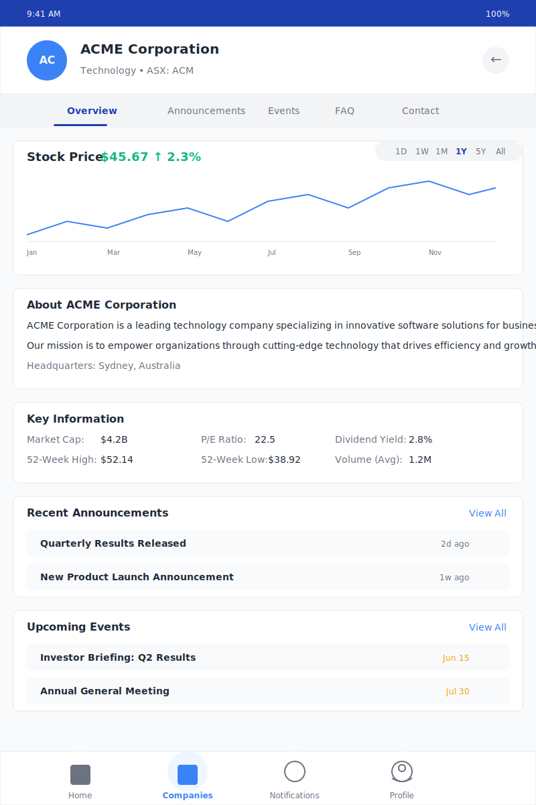

# Diolog Company Details Screen Wireframe

## Change Log

| Date | Description | Change Type |
|------|-------------|-------------|
| 2023-10-20 | Initial Company Details Screen wireframe creation | AI-generated based on PRD requirements |

## Current Version

## Description

The Company Details Screen wireframe represents the comprehensive company information view in the Diolog Mobile App. This screen provides investors with detailed information about a company, including stock performance, company description, key financial metrics, recent announcements, and upcoming events. The design follows the established color palette and typography guidelines to ensure visual coherence across the application.

## Key Components

1. **Company Header**
   - Displays company avatar with initials
   - Shows company name, industry, and stock ticker symbol
   - Back button to return to previous screen
   - Fixed at the top for context awareness

2. **Tab Navigation**
   - Allows switching between different sections of company information
   - Tabs include: Overview (active), Announcements, Events, FAQ, Contact
   - Active tab is highlighted with primary blue color and underline

3. **Stock Price Chart**
   - Displays current stock price with percentage change
   - Interactive line chart showing historical stock performance
   - Time period selector (1D, 1W, 1M, 1Y, 5Y, All)
   - Visual trend indicators (up/down arrows and colors)

4. **Company Description**
   - About section with company overview and mission statement
   - Key company information such as headquarters location
   - Concise yet informative text about the company's background

5. **Key Information**
   - Grid layout of important financial metrics
   - Includes Market Cap, P/E Ratio, Dividend Yield
   - Also shows 52-Week High/Low and Average Volume
   - Presented in a clean, scannable format

6. **Recent Announcements**
   - List of the most recent company announcements
   - Each item shows title and time since posting
   - "View All" link to access complete announcements history
   - Limited to 2-3 most recent items for overview purposes

7. **Upcoming Events**
   - List of scheduled company events
   - Each item shows event title and date
   - "View All" link to access complete events calendar
   - Limited to 2-3 upcoming events for overview purposes

8. **Navigation Bar**
   - Fixed at the bottom of the screen
   - Four main tabs: Home, Companies (active), Notifications, and Profile
   - Visual indicators for the active tab

## User Interactions

1. **Tapping the back button** returns to the previous screen (Company Conversation or Companies Tab)
2. **Tapping tab options** switches between different sections of company information
3. **Tapping time period selectors** changes the time range displayed on the stock chart
4. **Tapping "View All" for announcements** navigates to a complete list of company announcements
5. **Tapping "View All" for events** navigates to a complete list of company events
6. **Tapping an announcement** opens the full announcement details
7. **Tapping an event** opens the full event details with options to add to calendar
8. **Tapping navigation tabs** switches between different main sections of the app

## Design Notes

- Uses the primary blue (#1E40AF) for the status bar and active tab indicator
- Secondary blue (#3B82F6) for company avatar, chart line, and interactive elements
- Accent orange (#F59E0B) for event dates to create visual distinction
- White background with subtle gray borders for content sections to create visual separation
- Consistent typography using the Inter font family
- Consistent spacing and border radius across all elements
- Clear visual hierarchy with section headings and content organization