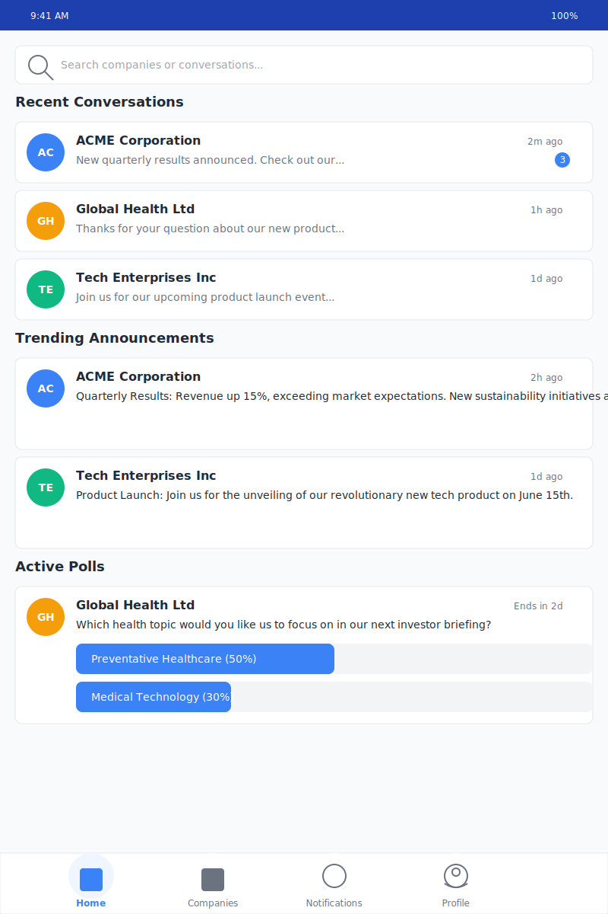

# Diolog Home Tab Wireframe

## Change Log

| Date | Description | Change Type |
|------|-------------|-------------|
| 2023-10-19 | Initial Home Tab wireframe creation | AI-generated based on PRD requirements |

## Current Version

## Description

The Home Tab wireframe represents the main landing screen of the Diolog Mobile App. It serves as the primary entry point for user interaction, displaying recent conversations with companies, trending announcements, and active polls. The design follows the established color palette and typography guidelines to ensure visual coherence across the application.

## Key Components

1. **Search Bar**
   - Positioned at the top for easy access
   - Allows users to search for specific companies or conversations
   - Includes search icon for visual clarity

2. **Recent Conversations List**
   - Displays company avatars with initials
   - Shows company name and message preview
   - Indicates time since last message
   - Notification badges for unread messages
   - Each conversation is a tappable card leading to the Company Conversation View

3. **Trending Announcements Section**
   - Highlights important company announcements
   - Displays company avatar, name, and announcement content
   - Shows time since posting
   - Each announcement is a tappable card for more details

4. **Active Polls Section**
   - Shows ongoing polls from companies
   - Displays poll question and voting options
   - Shows current voting percentages with visual progress bars
   - Indicates time remaining for the poll

5. **Navigation Bar**
   - Fixed at the bottom of the screen
   - Four main tabs: Home (active), Companies, Notifications, and Profile
   - Visual indicators for the active tab

## User Interactions

1. **Tapping a conversation card** navigates to the Company Conversation View for that specific company
2. **Tapping a trending announcement** opens the full announcement details
3. **Tapping a poll option** registers the user's vote (if not already voted)
4. **Tapping the search bar** activates the search functionality
5. **Tapping navigation tabs** switches between different main sections of the app

## Design Notes

- Uses the primary blue (#1E40AF) for the status bar and active elements
- Secondary blue (#3B82F6) for interactive elements like buttons and progress bars
- Accent orange (#F59E0B) for highlighting certain company avatars
- White background with subtle gray borders for cards to create visual separation
- Consistent typography using the Inter font family
- Consistent spacing and border radius across all elements