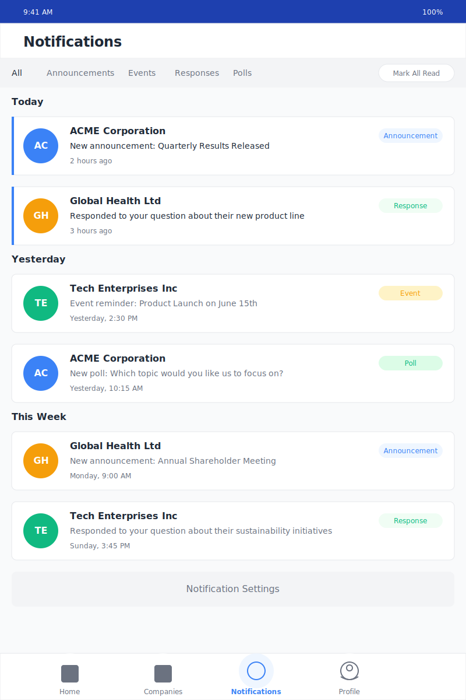

# Diolog Notifications Tab Wireframe

## Change Log

| Date | Description | Change Type |
|------|-------------|-------------|
| 2023-10-19 | Initial Notifications Tab wireframe creation | AI-generated based on PRD requirements |

## Current Version

## Description

The Notifications Tab wireframe represents the screen where users can view and manage their notifications in the Diolog Mobile App. This screen displays real-time alerts and interactive notifications from companies, organized chronologically and by type. The design follows the established color palette and typography guidelines to ensure visual coherence across the application.

## Key Components

1. **Header**
   - Simple header with the title "Notifications"
   - Provides clear context for the current screen

2. **Filter Bar**
   - Allows filtering notifications by type (All, Announcements, Events, Responses, Polls)
   - Includes a "Mark All Read" button to quickly clear notification indicators
   - Positioned below the header for easy access

3. **Chronological Sections**
   - Notifications are organized into time-based sections (Today, Yesterday, This Week, etc.)
   - Clear section headers provide temporal context
   - Helps users quickly find recent notifications

4. **Notification Cards**
   - Each notification is displayed as an interactive card with:
     - Company avatar with initials
     - Company name
     - Notification content/message
     - Timestamp
     - Notification type badge (color-coded)
     - Unread indicator (blue vertical line on the left)
   - Different visual styling for read vs. unread notifications

5. **Notification Type Badges**
   - Color-coded badges indicate the type of notification:
     - Announcements (blue)
     - Events (orange)
     - Responses (green)
     - Polls (green)
   - Helps users quickly identify notification types

6. **Notification Settings Button**
   - Button at the bottom of the list to access notification preferences
   - Allows users to customize which notifications they receive

7. **Navigation Bar**
   - Fixed at the bottom of the screen
   - Four main tabs: Home, Companies, Notifications (active), and Profile
   - Visual indicators for the active tab

## User Interactions

1. **Tapping a notification card** navigates to the relevant content (announcement, event, conversation with response, poll)
2. **Tapping filter options** changes the displayed notifications to show only the selected type
3. **Tapping "Mark All Read"** marks all notifications as read and removes unread indicators
4. **Tapping "Notification Settings"** navigates to notification preference settings
5. **Swiping left on a notification** (not shown in wireframe) could reveal quick actions (mark as read, delete, etc.)
6. **Tapping navigation tabs** switches between different main sections of the app

## Design Notes

- Uses the primary blue (#1E40AF) for the status bar
- Secondary blue (#3B82F6) for unread indicators and interactive elements
- Color-coded notification type badges for quick visual identification:
  - Blue for announcements
  - Orange for events
  - Green for responses and polls
- Unread notifications have a blue vertical line indicator and darker text
- Read notifications have lighter text color
- Consistent typography using the Inter font family
- Consistent spacing and border radius across all elements