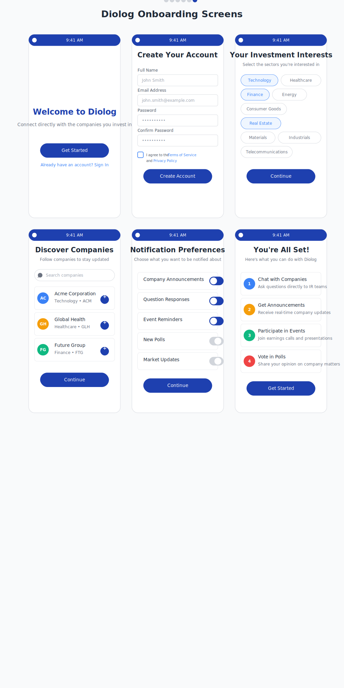

# Diolog Onboarding Screens Wireframe

## Change Log

| Date | Description | Change Type |
|------|-------------|-------------|
| 2023-10-20 | Initial Onboarding Screens wireframe creation | AI-generated based on PRD requirements |

## Current Version

## Description

The Onboarding Screens wireframe represents the user registration and initial setup process for the Diolog Mobile App. This series of screens guides new users through creating an account, selecting investment interests, discovering companies to follow, setting notification preferences, and introducing the app's key features. The design follows the established color palette and typography guidelines to ensure visual coherence across the application.

## Key Components

### Screen 1: Welcome Screen

- **App Logo/Branding**: Prominently displayed at the center of the screen
- **Welcome Message**: Clear headline introducing the app
- **Value Proposition**: Brief description of the app's purpose
- **Get Started Button**: Primary action button to begin the onboarding process
- **Sign In Link**: Secondary option for existing users

### Screen 2: Registration Form

- **Form Header**: Clear title indicating the purpose of the screen
- **Input Fields**:
  - Full Name field
  - Email Address field
  - Password field
  - Confirm Password field
- **Terms and Privacy**: Checkbox with links to Terms of Service and Privacy Policy
- **Create Account Button**: Primary action button to submit registration

### Screen 3: Investment Interests

- **Section Header**: Clear title indicating the purpose of the screen
- **Instructions**: Brief explanation of what to do on this screen
- **Interest Categories**: Selectable tags for different investment sectors
  - Technology, Healthcare, Finance, Energy, etc.
  - Selected interests are highlighted in blue
- **Continue Button**: Primary action button to proceed to the next step

### Screen 4: Company Discovery

- **Section Header**: Clear title indicating the purpose of the screen
- **Instructions**: Brief explanation of what to do on this screen
- **Search Bar**: For finding specific companies
- **Company Cards**: List of suggested companies based on selected interests
  - Company logo/avatar
  - Company name
  - Industry and ticker symbol
  - Follow button (+ icon)
- **Continue Button**: Primary action button to proceed to the next step

### Screen 5: Notification Preferences

- **Section Header**: Clear title indicating the purpose of the screen
- **Instructions**: Brief explanation of what to do on this screen
- **Notification Options**: Toggle switches for different notification types
  - Company Announcements
  - Question Responses
  - Event Reminders
  - New Polls
  - Market Updates
- **Continue Button**: Primary action button to proceed to the next step

### Screen 6: Welcome & App Introduction

- **Success Message**: Confirmation that setup is complete
- **Feature Cards**: Introduction to key app features
  - Chat with Companies
  - Get Announcements
  - Participate in Events
  - Vote in Polls
- **Get Started Button**: Primary action button to enter the main app
- **Navigation Dots**: Visual indicator of current position in the onboarding flow

## User Interactions

1. **Tapping "Get Started"** on the Welcome Screen navigates to the Registration Form
2. **Tapping "Sign In"** navigates to the Sign In screen (not shown in this wireframe)
3. **Tapping "Create Account"** after filling the registration form navigates to the Investment Interests screen
4. **Tapping interest categories** toggles their selection state (selected/unselected)
5. **Tapping "+" buttons** on company cards adds those companies to the user's followed list
6. **Tapping toggle switches** enables/disables specific notification types
7. **Tapping "Continue"** on each screen advances to the next onboarding step
8. **Tapping "Get Started"** on the final screen completes the onboarding process and enters the main app

## Design Notes

- Uses the primary blue (#1E40AF) for the status bar, primary buttons, and selected states
- Secondary blue (#3B82F6) for interactive elements and company avatars
- Accent colors for various company avatars and feature icons to create visual distinction
- White background with subtle gray borders for cards and input fields
- Consistent typography using the Inter font family
- Consistent spacing and border radius across all elements
- Navigation dots at the bottom of the final screen indicate the multi-step nature of the onboarding process