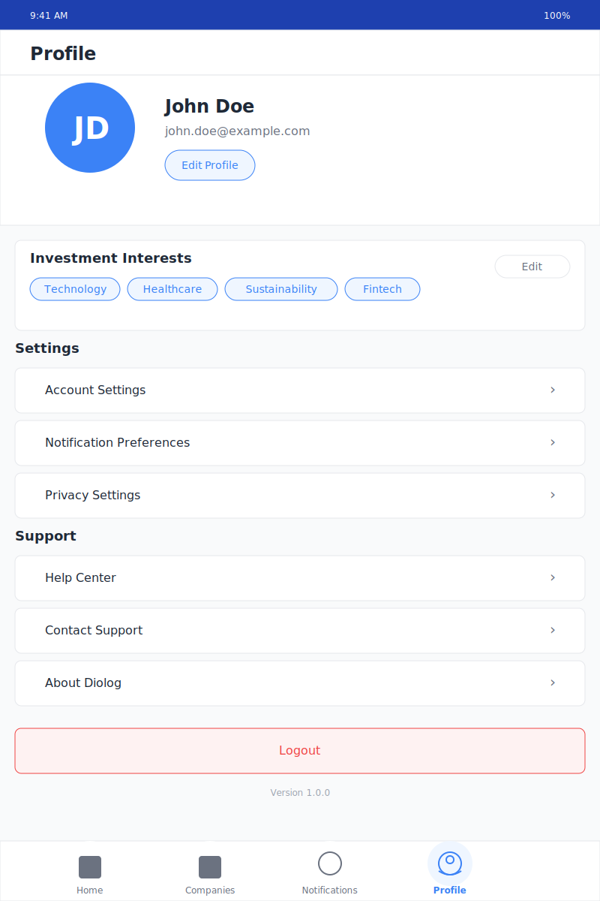

# Diolog Profile Tab Wireframe

## Change Log

| Date | Description | Change Type |
|------|-------------|-------------|
| 2023-10-19 | Initial Profile Tab wireframe creation | AI-generated based on PRD requirements |

## Current Version

## Description

The Profile Tab wireframe represents the screen where users can view and manage their personal information and app settings in the Diolog Mobile App. This screen provides access to account management, notification preferences, privacy settings, help resources, and logout functionality. The design follows the established color palette and typography guidelines to ensure visual coherence across the application.

## Key Components

1. **Header**
   - Simple header with the title "Profile"
   - Provides clear context for the current screen

2. **User Profile Section**
   - Displays user avatar with initials
   - Shows user name and email address
   - "Edit Profile" button to modify personal information
   - Positioned prominently at the top of the screen

3. **Investment Interests Section**
   - Displays the user's selected investment interests as tags
   - Includes an "Edit" button to modify interests
   - Helps personalize the app experience based on user preferences

4. **Settings Section**
   - Provides access to various app settings:
     - Account Settings (password, email, etc.)
     - Notification Preferences (which notifications to receive)
     - Privacy Settings (data sharing, visibility options)
   - Each setting is a tappable row with a chevron indicator

5. **Support Section**
   - Provides access to help and support resources:
     - Help Center (documentation and FAQs)
     - Contact Support (direct communication with support team)
     - About Diolog (app information and legal details)
   - Each option is a tappable row with a chevron indicator

6. **Logout Button**
   - Prominent button to sign out of the app
   - Visually distinct with red color to indicate caution

7. **App Version**
   - Displays the current version of the app
   - Useful for support and troubleshooting

8. **Navigation Bar**
   - Fixed at the bottom of the screen
   - Four main tabs: Home, Companies, Notifications, and Profile (active)
   - Visual indicators for the active tab

## User Interactions

1. **Tapping "Edit Profile"** navigates to a screen to modify personal information
2. **Tapping "Edit" in Investment Interests** opens a screen to modify investment preferences
3. **Tapping any setting row** navigates to the corresponding settings screen
4. **Tapping any support row** navigates to the corresponding support resource
5. **Tapping "Logout"** signs the user out of the app (likely with a confirmation dialog)
6. **Tapping navigation tabs** switches between different main sections of the app

## Design Notes

- Uses the primary blue (#1E40AF) for the status bar
- Secondary blue (#3B82F6) for the user avatar and interactive elements
- Blue outline for interest tags and buttons to maintain visual consistency
- Red color for the logout button to indicate a cautionary action
- White background with subtle gray borders for sections and rows
- Consistent typography using the Inter font family
- Consistent spacing and border radius across all elements
- Chevron indicators (›) for navigable rows to indicate additional screens