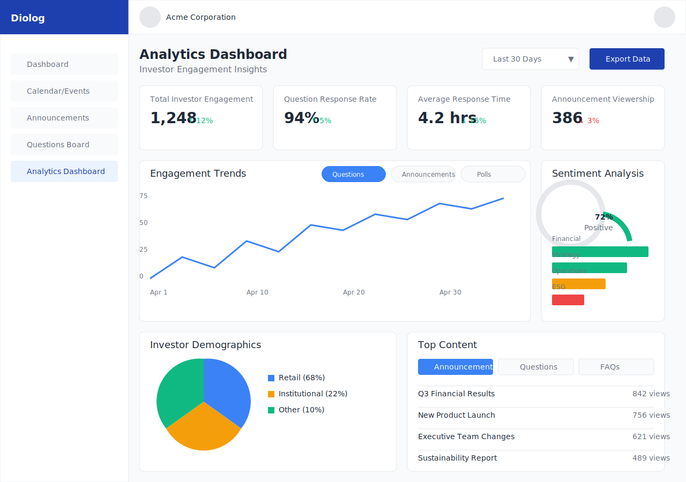

# Diolog Web Application - Analytics Dashboard Wireframe

## Overview
This wireframe illustrates the Analytics Dashboard of the Diolog Web Application, providing company users with comprehensive data visualization and metrics related to investor engagement, sentiment, and demographics. The Analytics Dashboard serves as a powerful tool for IR teams to gain insights into investor behavior and make data-driven decisions.

## Components

### Header Section
- **Page Title**: "Analytics Dashboard" with subtitle "Investor Engagement Insights"
- **Date Range Selector**: Dropdown/calendar interface to select data timeframe (Last 7 days, Last 30 days, Last Quarter, Custom Range)
- **Export Options**: Button to export analytics data in various formats (CSV, Excel, PDF)

### Key Metrics Cards
- **Total Investor Engagement**: Number of active investors interacting with company content
- **Question Response Rate**: Percentage of investor questions that received responses
- **Average Response Time**: Average time taken to respond to investor questions
- **Announcement Viewership**: Average views per announcement

### Engagement Trends Chart
- **Line Chart**: Showing investor engagement metrics over time
- **Multiple Metrics**: Toggle options to display different metrics (Questions Received, Announcement Views, Poll Participation)
- **Trend Indicators**: Visual indicators showing whether metrics are increasing or decreasing compared to previous period

### Sentiment Analysis Section
- **Overall Sentiment Gauge**: Visual gauge showing overall investor sentiment (Positive, Neutral, Negative)
- **Sentiment Trend Chart**: Line chart showing sentiment changes over time
- **Sentiment by Category**: Bar chart breaking down sentiment by question/topic categories
- **Key Terms Cloud**: Word cloud showing frequently mentioned terms in investor questions

### Investor Demographics
- **Investor Type Breakdown**: Pie chart showing distribution of investor types (Retail, Institutional, etc.)
- **Geographic Distribution**: Map visualization showing investor locations (if data available)
- **Investor Activity Heatmap**: Showing most active times/days for investor engagement

### Top Content Section
- **Most Viewed Announcements**: List of announcements with highest view counts
- **Most Engaged Questions**: List of questions that generated most follow-up activity
- **Popular FAQ Topics**: Categories or topics most frequently accessed in FAQs

### Filter Panel
- **Category Filters**: Filter analytics by question/announcement categories
- **Investor Type Filters**: Filter data by investor types
- **Advanced Filters**: Additional filtering options for deeper analysis

## Design Specifications

### Colors
- Primary Blue: #1E40AF (headers, primary buttons)
- Secondary Blue: #3B82F6 (charts, interactive elements)
- Background: #F9FAFB (main content area)
- Card Background: #FFFFFF
- Text: #1F2937 (primary text)
- Light Text: #6B7280 (secondary text, labels)
- Success Green: #10B981 (positive metrics, upward trends)
- Warning Orange: #F59E0B (neutral metrics)
- Error Red: #EF4444 (negative metrics, downward trends)
- Chart Colors: A consistent color palette for all data visualizations

### Typography
- Font Family: Inter, sans-serif
- Page Title: 24px bold
- Section Headers: 18px semibold
- Metric Values: 28px bold
- Metric Labels: 14px regular
- Chart Labels: 12px regular
- Filter Text: 14px regular

### Layout
- Full-width dashboard with responsive grid layout
- Key metrics displayed in card format at the top
- Charts and visualizations arranged in a logical flow
- Sidebar navigation consistent with other application pages
- Filter panel accessible via toggle button

## User Flow

1. **Accessing Analytics**:
   - Users navigate to the Analytics Dashboard from the sidebar navigation
   - Dashboard loads with default date range (Last 30 days)

2. **Viewing Data**:
   - Users can quickly scan key metrics at the top of the dashboard
   - Scrolling reveals more detailed charts and visualizations
   - Hovering over charts shows detailed tooltips with specific data points

3. **Filtering Data**:
   - Users can select different date ranges to view data for specific time periods
   - Category and investor type filters allow for more focused analysis
   - Applied filters are visually indicated and can be easily removed

4. **Exporting Data**:
   - Users can export the entire dashboard or specific charts/data sets
   - Export options include common formats (CSV, Excel, PDF)
   - Export dialog allows selection of what data to include

## Accessibility Considerations
- All charts include alternative text descriptions for screen readers
- Color choices maintain sufficient contrast for readability
- Interactive elements are keyboard navigable
- Data tables available as alternatives to visual charts

## Responsive Behavior
- On smaller screens, the dashboard reorganizes into a single column layout
- Charts resize appropriately for different screen sizes
- Filter panel becomes a collapsible drawer on mobile devices
- Touch-friendly controls for mobile users

## Latest Version

## Change Log

| Date | Description | Author |
|------|-------------|--------|
| 2023-11-02 | Initial creation of Analytics Dashboard wireframe | AI-assisted design |
