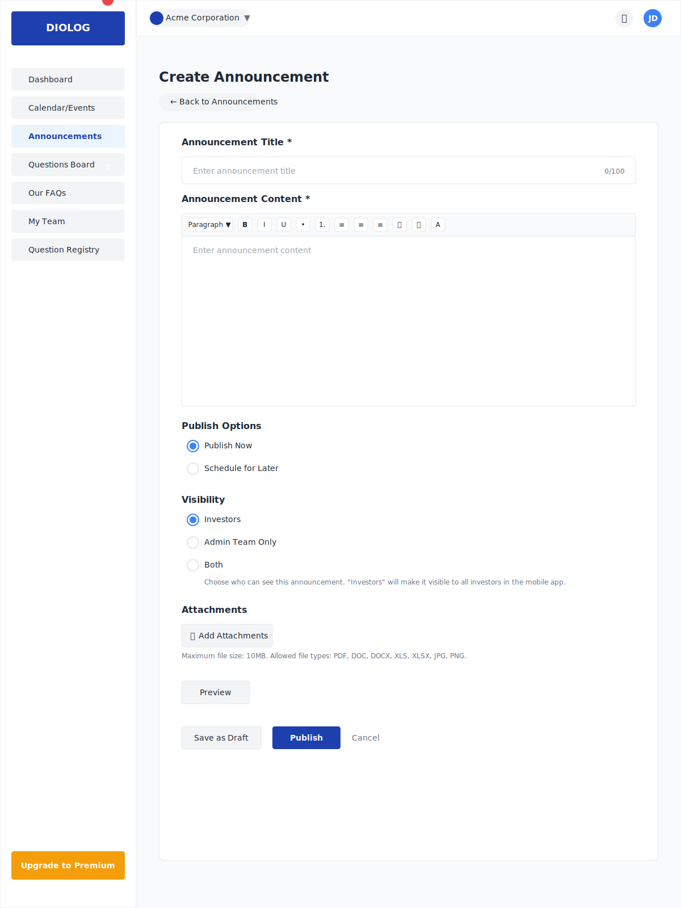

# Diolog Web Application - Announcement Creation Wireframe

## Overview
This document describes the Announcement Creation wireframe for the Diolog Web Application. The Announcement Creation form provides a comprehensive interface for creating and publishing company announcements, allowing IR teams to craft, schedule, and manage communications with investors.

## Components

### Navigation Elements
1. **Sidebar Navigation**
   - Company logo/branding
   - Menu items with Announcements highlighted as active
   - Notification badge showing 5 outstanding questions in Questions Board
   - Upgrade to Premium CTA button

2. **Top Header**
   - Company profile dropdown
   - Notification icon
   - User profile dropdown

### Announcement Creation Content

3. **Page Header**
   - "Create Announcement" title
   - Back to Announcements button

4. **Announcement Form**
   - **Title Field**
     - Label: "Announcement Title"
     - Required field indicator (*)
     - Placeholder: "Enter announcement title"
     - Character counter (e.g., 0/100)

   - **Rich Text Editor**
     - Full-featured text editor for announcement content
     - Formatting toolbar with options:
       - Text styles (Paragraph, Heading 1, Heading 2, etc.)
       - Bold, Italic, Underline, Strikethrough
       - Bullet list, Numbered list
       - Text alignment (Left, Center, Right, Justify)
       - Insert link, Insert image
       - Text color, Background color
     - Required field indicator (*)
     - Placeholder: "Enter announcement content"

   - **Publish Options**
     - Radio button group:
       - "Publish Now" (default selected)
       - "Schedule for Later"
     - Date and time picker (visible when "Schedule for Later" is selected)
       - Date field with calendar popup
       - Time field with time picker

   - **Visibility Settings**
     - Radio button group:
       - "Investors" (default selected)
       - "Admin Team Only"
       - "Both"
     - Help text explaining each option

   - **Attachments**
     - "Add Attachments" button with upload icon
     - List of uploaded attachments (if any)
     - For each attachment:
       - File name
       - File size
       - File type icon
       - Remove button (×)
     - Maximum file size indicator
     - Allowed file types indicator

   - **Preview Option**
     - "Preview" button to see how the announcement will appear to investors

5. **Action Buttons**
   - "Save as Draft" button (secondary style)
   - "Schedule" button (visible when "Schedule for Later" is selected, primary style)
   - "Publish" button (visible when "Publish Now" is selected, primary style)
   - "Cancel" button (text-only style)

## Design Notes

- **Form Layout**: Clean, well-spaced form with clear section separation
- **Rich Text Editor**: Prominent and spacious editor area for content creation
- **Validation**: Visual indicators for required fields and validation errors
- **Responsive Design**: Form adapts to different screen sizes while maintaining usability
- **Consistent Styling**: Follows the Diolog design system with consistent colors, typography, and spacing

## Interactions

- Selecting "Schedule for Later" reveals the date and time picker
- Clicking "Add Attachments" opens a file browser dialog
- Clicking "Preview" opens a modal showing how the announcement will appear to investors
- Clicking "Save as Draft" saves the announcement as a draft without publishing
- Clicking "Schedule" saves and schedules the announcement for the selected date and time
- Clicking "Publish" immediately publishes the announcement to the selected audience
- Clicking "Cancel" returns to the Announcements list without saving changes (with confirmation dialog)
- Form validation occurs on submission, highlighting any errors or missing required fields

## Changelog

| Date | Version | Description | Author |
|------|---------|-------------|--------|
| 2023-11-02 | 1.0 | Initial wireframe creation | AI-generated based on PRD requirements |

