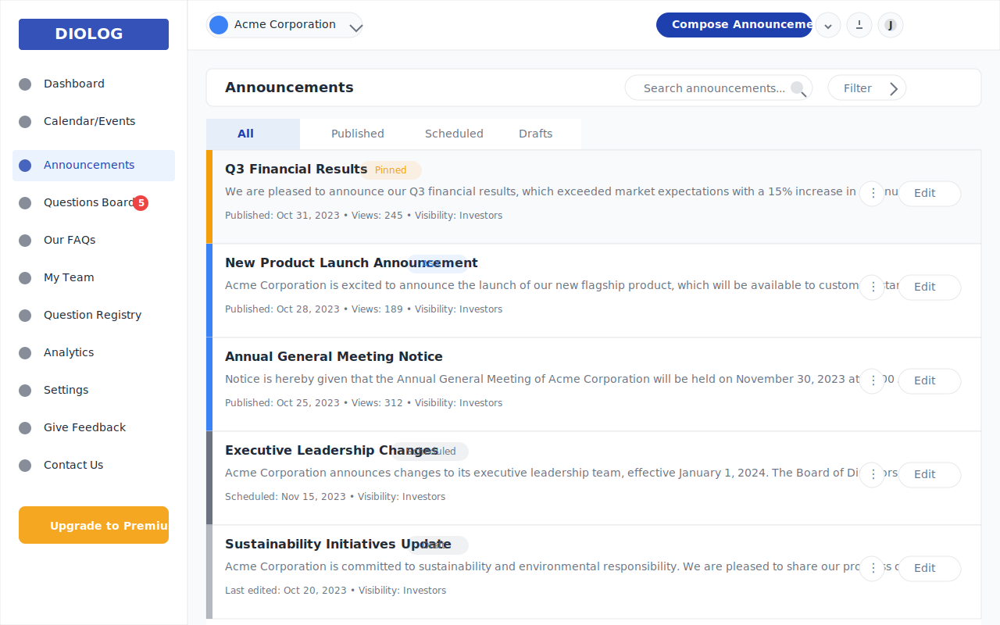

# Diolog Web Application - Announcements Wireframe

## Overview
This document describes the Announcements wireframe for the Diolog Web Application. The Announcements page provides a comprehensive interface for managing company announcements, allowing IR teams to create, publish, schedule, and manage communications with investors.

## Components

### Navigation Elements
1. **Sidebar Navigation**
   - Company logo/branding
   - Menu items with Announcements highlighted as active
   - Notification badge showing 5 outstanding questions in Questions Board
   - Upgrade to Premium CTA button

2. **Top Header**
   - Company profile dropdown
   - Compose Announcement button (primary action)
   - Notification icon
   - User profile dropdown

### Announcements Content

3. **Page Header**
   - "Announcements" title
   - Search bar for announcements
   - Filter dropdown

4. **Announcement Tabs**
   - All (active)
   - Published
   - Scheduled
   - Drafts

5. **Announcements List**
   - Each announcement card includes:
     - Announcement title
     - Announcement snippet/preview
     - Publication date and time
     - View count
     - Visibility setting (Investors, Admin Team, or Both)
     - Status indicators (Pinned, ASX, Scheduled, Draft)
     - Color-coded left border indicating status
     - Edit button and options menu (⋮)

6. **Special Announcement Types**
   - **Pinned Announcement**: Highlighted with orange "Pinned" badge and orange left border
   - **ASX Announcement**: Marked with blue "ASX" badge and blue left border
   - **Scheduled Announcement**: Marked with gray "Scheduled" badge and gray left border
   - **Draft Announcement**: Marked with gray "Draft" badge and light gray left border

## Design Notes

- **Color Coding**: Announcements use color-coded left borders to indicate status (orange for pinned, blue for published, gray for scheduled, light gray for drafts)
- **Status Badges**: Clear visual indicators for special announcement types (Pinned, ASX, Scheduled, Draft)
- **List Layout**: Clean, card-based layout with consistent spacing and information hierarchy
- **Metadata Display**: Consistent display of metadata (publication date, view count, visibility) for each announcement

## Interactions

- Clicking on an announcement title or content should open the announcement details view
- Compose Announcement button opens the announcement creation form
- Edit button opens the announcement editing form for the selected announcement
- Options menu (⋮) provides additional actions (Delete, Pin/Unpin, Archive, etc.)
- Tabs allow filtering announcements by status (All, Published, Scheduled, Drafts)
- Search bar allows filtering announcements by keyword
- Filter dropdown provides additional filtering options (by date, visibility, etc.)

## Changelog

| Date | Version | Description | Author |
|------|---------|-------------|--------|
| 2023-11-01 | 1.0 | Initial wireframe creation | AI-generated based on PRD requirements |

