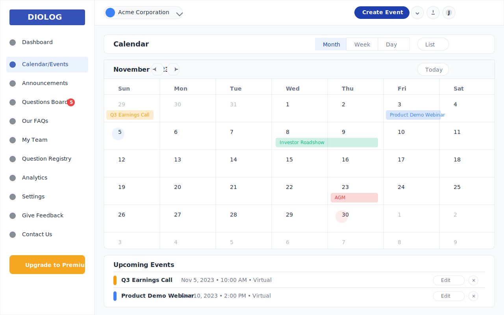

# Diolog Web Application - Calendar/Events Wireframe

## Overview
This document describes the Calendar/Events wireframe for the Diolog Web Application. The Calendar/Events page provides a comprehensive interface for managing company events, allowing IR teams to schedule, view, and manage investor-related events.

## Components

### Navigation Elements
1. **Sidebar Navigation**
   - Company logo/branding
   - Menu items with Calendar/Events highlighted as active
   - Notification badge showing 5 outstanding questions in Questions Board
   - Upgrade to Premium CTA button

2. **Top Header**
   - Company profile dropdown
   - Create Event button (primary action)
   - Notification icon
   - User profile dropdown

### Calendar/Events Content

3. **Page Header**
   - "Calendar" title
   - View toggle tabs (Month, Week, Day, List) with Month view active

4. **Calendar Month View**
   - Month navigation header with:
     - Current month and year display (November 2023)
     - Previous/Next month navigation buttons
     - "Today" button to quickly navigate to current date
   - Day headers (Sun, Mon, Tue, Wed, Thu, Fri, Sat)
   - Calendar grid showing days of the month
   - Days from previous/next month shown in lighter color
   - Current day highlighted
   - Events displayed on their respective dates with color-coding by event type

5. **Events in Calendar**
   - Q3 Earnings Call (Nov 5) - Orange
   - Product Demo Webinar (Nov 10) - Blue
   - Investor Roadshow (Nov 15-17) - Green
   - Annual General Meeting (Nov 30) - Red

6. **Upcoming Events List**
   - List of upcoming events below the calendar
   - For each event, showing:
     - Color-coded event type indicator
     - Event title
     - Date, time, and location
     - Edit and Delete options

## Design Notes

- **Color Coding**: Events are color-coded by type (orange for earnings calls, blue for webinars, green for roadshows, red for meetings)
- **Calendar Navigation**: Easy navigation between months with previous/next buttons and quick access to current date
- **Multi-day Events**: Events spanning multiple days (like the Investor Roadshow) are shown across the relevant dates
- **Event Management**: Quick access to edit or delete events from the list view

## Interactions

- Clicking on a day in the calendar should show events for that day or allow creating a new event
- Clicking on an event in the calendar should open the event details view
- View toggle tabs allow switching between different calendar views (Month, Week, Day, List)
- Create Event button opens the event creation form
- Edit button opens the event editing form for the selected event
- Delete button (×) removes the event after confirmation

## Changelog

| Date | Version | Description | Author |
|------|---------|-------------|--------|
| 2023-11-01 | 1.0 | Initial wireframe creation | AI-generated based on PRD requirements |

