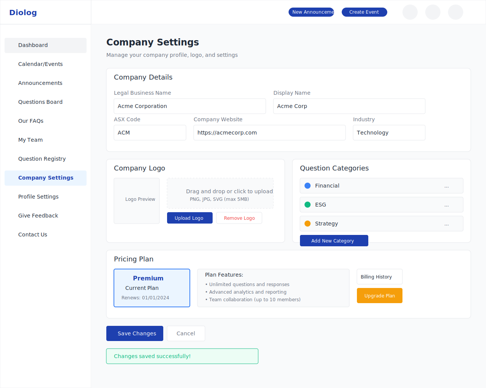

# Diolog Web Application - Company Settings Wireframe

## Overview
This wireframe illustrates the Company Settings page of the Diolog Web Application, where company administrators can manage their company profile, logo, question categories, and view pricing plan information.

## Components
1. **Company Details View** - Displays current company information
2. **Edit Company Details Form** - Form for updating company information
3. **Company Logo Upload** - Interface for uploading and managing company logo
4. **Question Categories Management** - Interface for creating, editing, and deleting question categories
5. **Pricing Plan Information** - Displays current subscription details
6. **Form Validation** - Visual indicators for form validation
7. **Save Changes and Confirmation Messages** - UI elements for saving changes and displaying confirmation

## Design Specifications
- **Color Palette**: Following Diolog design guidelines
  - Primary: #1E40AF
  - Secondary: #3B82F6
  - Accent: #F59E0B
  - Background: #F9FAFB
  - Text: #1F2937
  - Light Text: #6B7280
  - Success: #10B981
  - Error: #EF4444
  - Border: #E5E7EB
  - Card: #FFFFFF
- **Typography**: Inter, sans-serif
- **Layout**: Responsive design with card-based sections

## Wireframe

## User Flow
1. User navigates to Company Settings from the sidebar navigation
2. User views current company details
3. User can edit company information by clicking the "Edit" button
4. User can upload or change company logo
5. User can manage question categories (add, edit, delete)
6. User can view current pricing plan information
7. User saves changes and receives confirmation

## Sections

### Company Details Section
- Company Name (Legal Business Name)
- Display Name
- ASX Code (for ASX-listed companies)
- Company Website
- Company Industry
- Edit button

### Company Logo Section
- Current logo display
- Upload new logo button
- Remove logo button
- Supported file formats and size limits information

### Question Categories Management Section
- List of existing categories with color indicators
- Add Category button
- Edit and Delete options for each category
- Category name input field
- Color selector for categories

### Pricing Plan Section
- Current plan display (Free, Basic, Premium, Enterprise)
- Plan features summary
- Upgrade button (if not on highest tier)
- Billing cycle information
- Link to billing history

### Form Actions
- Save Changes button (primary action)
- Cancel button
- Confirmation messages for successful actions
- Error messages for validation failures

## Changelog

| Date | Description | Author |
|------|-------------|--------|
| 2023-11-02 | Initial wireframe creation | AI-assisted design |
