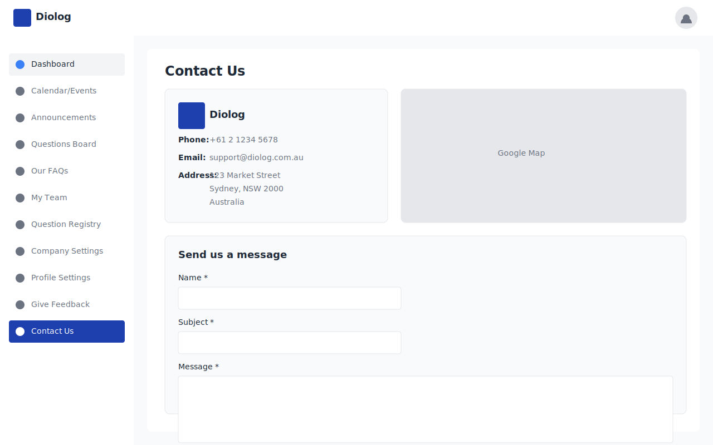

# Diolog Web Application - Contact Us Wireframe

## Overview
This wireframe illustrates the Contact Us page for the Diolog Web Application. The page provides company contact information, a Google Map showing the company's location, and a contact form for users to send messages directly to Diolog.

## Components

### 1. Contact Information Section
- **Diolog Logo and Name**: Prominently displayed at the top of the contact information section
- **Phone Number**: Direct contact number for Diolog support
- **Email Address**: Support email address for inquiries
- **Physical Address**: Complete address with street, city, state, postal code, and country

### 2. Google Map Integration
- **Map Display**: Embedded Google Map showing Diolog's physical location
- **Static Map**: A static map image that visually represents the company's location

### 3. Contact Form
- **Form Title**: "Send us a message" heading
- **Name Field**: Required input field for the user's name
- **Subject Field**: Required input field for the message subject
- **Message Field**: Required text area for the detailed message content
- **Send Message Button**: Primary action button to submit the form

### 4. Additional Links
- **Help Link**: "Need help? Click here" link directing to the Diolog Help Center
- **Website Link**: Link back to the main Diolog website

## Design Specifications

### Layout
- **Sidebar**: Standard navigation sidebar with "Contact Us" highlighted
- **Header**: Standard application header with Diolog logo and user profile
- **Main Content**: Two-column layout for contact information and map, with full-width contact form below

### Color Scheme
- Primary Blue (#1E40AF) for buttons and highlights
- Secondary Blue (#3B82F6) for links
- Background (#F9FAFB) for page and card backgrounds
- White (#FFFFFF) for content areas and input fields
- Text colors: Dark (#1F2937) for headings and labels, Medium (#6B7280) for regular text
- Border color (#E5E7EB) for cards and input fields

### Typography
- Font Family: Inter, sans-serif
- Page Title: 24px bold
- Section Titles: 18px semibold
- Field Labels: 14px medium
- Regular Text: 14px regular

## User Flow
1. User navigates to the Contact Us page via the sidebar navigation
2. User views Diolog's contact information and location on the map
3. User fills out the contact form with their name, subject, and message
4. User clicks the "Send Message" button to submit the form
5. Button changes to "Sent" state to indicate successful submission
6. User can also access the Help Center or main website via the provided links

## Accessibility Considerations
- All form fields have clear labels
- Required fields are marked with an asterisk (*)
- Form validation provides clear error messages for invalid submissions
- Sufficient color contrast between text and background elements

## Implementation Notes
- Google Map integration should use a static map or embedded iframe
- Contact form submissions should be sent to a designated Diolog email address
- Form validation should be implemented for required fields
- "Send Message" button should change state to "Sent" upon successful submission

## Wireframe Image

## Change Log

| Date | Description | Change Type |
|------|-------------|-------------|
| 2023-11-02 | Initial wireframe creation | AI-generated |
