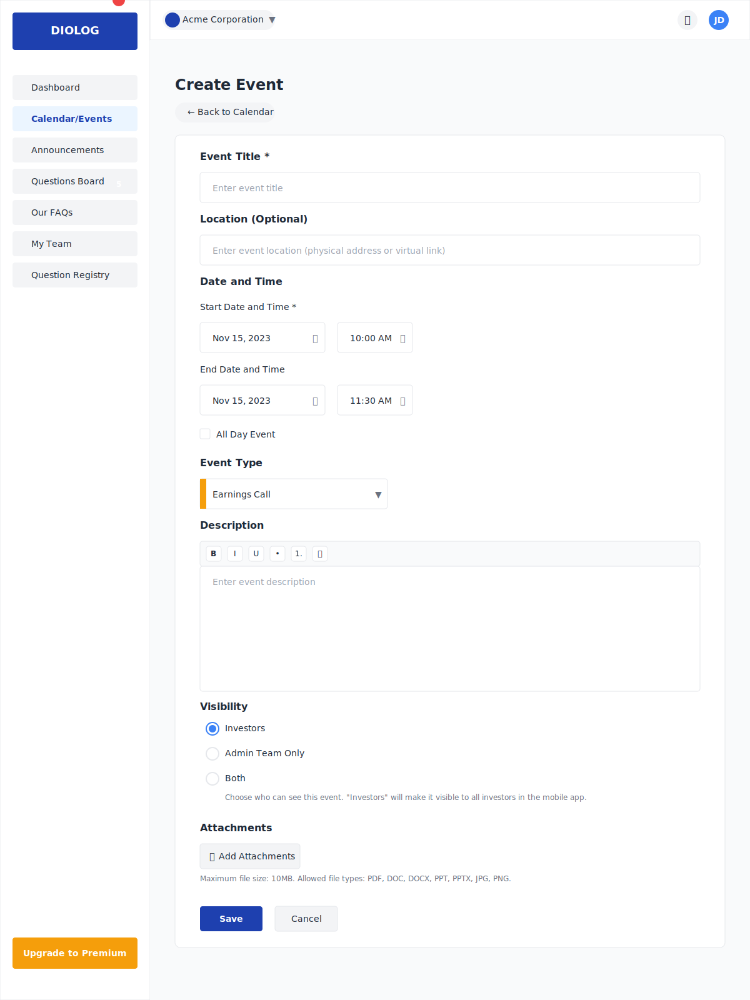

# Diolog Web Application - Event Creation Wireframe

## Overview
This document describes the Event Creation wireframe for the Diolog Web Application. The Event Creation form provides a comprehensive interface for creating and scheduling company events, allowing IR teams to plan and manage investor-related activities.

## Components

### Navigation Elements
1. **Sidebar Navigation**
   - Company logo/branding
   - Menu items with Calendar/Events highlighted as active
   - Notification badge showing 5 outstanding questions in Questions Board
   - Upgrade to Premium CTA button

2. **Top Header**
   - Company profile dropdown
   - Notification icon
   - User profile dropdown

### Event Creation Content

3. **Page Header**
   - "Create Event" title
   - Back to Calendar button

4. **Event Form**
   - **Title Field**
     - Label: "Event Title"
     - Required field indicator (*)
     - Placeholder: "Enter event title"

   - **Location Field**
     - Label: "Location"
     - Placeholder: "Enter event location (physical address or virtual link)"
     - Optional field indicator

   - **Date and Time Section**
     - **Start Date and Time**
       - Label: "Start Date and Time"
       - Required field indicator (*)
       - Date picker with calendar popup
       - Time picker with hour/minute selection
     - **End Date and Time**
       - Label: "End Date and Time"
       - Date picker with calendar popup
       - Time picker with hour/minute selection
     - **All Day Event Checkbox**
       - Label: "All Day Event"
       - Checkbox that, when selected, hides the time pickers

   - **Event Type/Category**
     - Label: "Event Type"
     - Dropdown selection with options:
       - Earnings Call (orange)
       - Webinar (blue)
       - Roadshow (green)
       - Meeting (red)
       - Other (gray)
     - Color indicator next to each option

   - **Description**
     - Label: "Description"
     - Rich text editor for event description
     - Formatting toolbar with basic options
     - Placeholder: "Enter event description"

   - **Visibility Settings**
     - Radio button group:
       - "Investors" (default selected)
       - "Admin Team Only"
       - "Both"
     - Help text explaining each option

   - **Attachments**
     - "Add Attachments" button with upload icon
     - List of uploaded attachments (if any)
     - For each attachment:
       - File name
       - File size
       - File type icon
       - Remove button (×)
     - Maximum file size indicator
     - Allowed file types indicator

5. **Action Buttons**
   - "Save" button (primary style)
   - "Cancel" button (secondary style)

## Design Notes

- **Form Layout**: Clean, well-spaced form with clear section separation
- **Date and Time Pickers**: Intuitive calendar and time selection interfaces
- **Color Coding**: Event types are color-coded for visual distinction and consistency with calendar view
- **Validation**: Visual indicators for required fields and validation errors
- **Responsive Design**: Form adapts to different screen sizes while maintaining usability

## Interactions

- Clicking the calendar icon opens a date picker popup
- Clicking the time field opens a time picker popup
- Checking "All Day Event" hides the time pickers and sets the event to span the entire day(s)
- Selecting an event type updates the color indicator
- Clicking "Add Attachments" opens a file browser dialog
- Clicking "Save" validates the form and creates the event if all required fields are filled
- Clicking "Cancel" returns to the Calendar view without saving changes (with confirmation dialog)
- Form validation occurs on submission, highlighting any errors or missing required fields

## Changelog

| Date | Version | Description | Author |
|------|---------|-------------|--------|
| 2023-11-02 | 1.0 | Initial wireframe creation | AI-generated based on PRD requirements |

