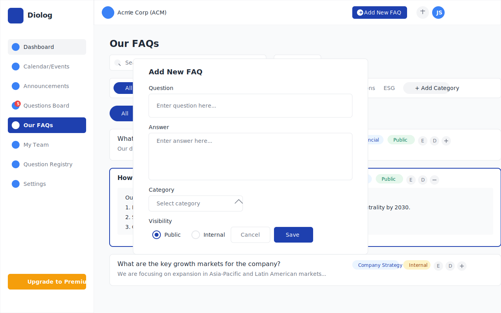

# Diolog Web Application - Our FAQs Wireframe

## Overview
This document describes the Our FAQs wireframe for the Diolog Web Application. The FAQs page provides a comprehensive interface for managing company FAQs, allowing IR teams to create, categorize, and manage frequently asked questions and their answers for investors.

## Components

### Navigation Elements
1. **Sidebar Navigation**
   - Company logo/branding
   - Menu items with Our FAQs highlighted as active
   - Notification badge showing 5 outstanding questions in Questions Board
   - Upgrade to Premium CTA button

2. **Top Header**
   - Company profile dropdown
   - Add New FAQ button (primary action)
   - Notification icon
   - User profile dropdown

### FAQs Content

3. **Page Header**
   - "Our FAQs" title
   - Search bar for FAQs
   - Filter dropdown

4. **FAQ Categories**
   - Horizontal tab navigation for categories:
     - All (active)
     - Financial Information
     - Company Strategy
     - Shareholder Information
     - Operations
     - ESG
     - + Add Category button

5. **Visibility Filter**
   - Toggle buttons:
     - All (active)
     - Public
     - Internal

6. **FAQs List**
   - Each FAQ card includes:
     - Question text
     - Answer preview/snippet
     - Category tag
     - Visibility indicator (Public/Internal)
     - Edit button
     - Delete button
     - Expand/Collapse button

7. **Expanded FAQ Card**
   - Shows full question and answer
   - Rich text formatting for answer
   - Category tag
   - Visibility indicator
   - Edit and Delete buttons
   - Collapse button

8. **Add New FAQ Form (Modal)**
   - Question field (required)
   - Answer field with rich text editor (required)
   - Category dropdown
   - Visibility radio buttons (Public/Internal)
   - Save and Cancel buttons

## Design Notes

- **Card Layout**: Clean, card-based layout with consistent spacing and information hierarchy
- **Category Tabs**: Horizontal scrollable tabs for categories with visual indicators for active category
- **Visibility Indicators**: Clear visual indicators for FAQ visibility (Public/Internal)
- **Search and Filtering**: Prominent search bar and filtering options for easy FAQ management
- **Responsive Design**: Layout adapts to different screen sizes while maintaining usability

## Interactions

- Clicking "Add New FAQ" button opens the Add New FAQ modal form
- Clicking category tabs filters FAQs by the selected category
- Clicking visibility toggle buttons filters FAQs by visibility status
- Clicking the search bar allows searching FAQs by keyword
- Clicking the Expand/Collapse button on an FAQ card toggles between collapsed and expanded views
- Clicking the Edit button opens the Edit FAQ modal form with pre-filled values
- Clicking the Delete button shows a confirmation dialog before deleting the FAQ
- Clicking "+ Add Category" opens a small input field to add a new category

## Changelog

| Date | Version | Description | Author |
|------|---------|-------------|--------|
| 2023-11-02 | 1.0 | Initial wireframe creation | AI-generated based on PRD requirements |
| 2023-11-15 | 1.1 | Updated layout and fixed visual elements | AI-generated based on user feedback |

