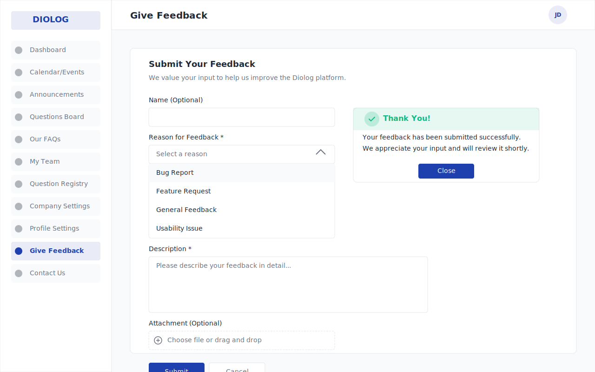

# Diolog Web Application - Give Feedback Wireframe

## Overview
This wireframe illustrates the Give Feedback page for the Diolog Web Application. The page provides a form for users to submit feedback about the platform, including bug reports, feature requests, general feedback, and usability issues.

## Components
1. **Feedback Form**
   - Simple form layout with clear labels and input fields
   - Optional name field
   - Required reason for feedback dropdown
   - Required description text area
   - Optional attachment upload

2. **Reason for Feedback Dropdown**
   - Options include: Bug Report, Feature Request, General Feedback, Usability Issue
   - Required field with validation

3. **Description Text Area**
   - Large text area for detailed feedback
   - Required field with validation

4. **Attachment Upload**
   - File upload functionality with drag and drop support
   - Optional field

5. **Submit and Cancel Buttons**
   - Clear action buttons at the bottom of the form
   - Submit button in primary color
   - Cancel button as secondary option

6. **Confirmation Message**
   - Success message displayed after successful submission
   - Thank you message with acknowledgment of receipt
   - Close button to dismiss the message

## Design Specifications
- **Color Palette**: Following the Diolog design system with primary blue (#1E40AF), success green (#10B981), and neutral grays
- **Typography**: Inter font family with appropriate sizing for headings and body text
- **Spacing**: Consistent spacing between form elements for readability
- **Layout**: Clean, single-column form layout with clear visual hierarchy

## User Flow
1. User navigates to the Give Feedback page from the sidebar navigation
2. User fills out the feedback form (name optional, reason and description required)
3. User optionally attaches a file
4. User submits the form
5. System validates the form
6. Upon successful submission, a confirmation message is displayed
7. User can close the confirmation message and return to the application

## Wireframe

## Change Log

| Date | Description | Source |
|------|-------------|--------|
| 2023-11-02 | Initial wireframe creation | AI-generated based on PRD requirements |
