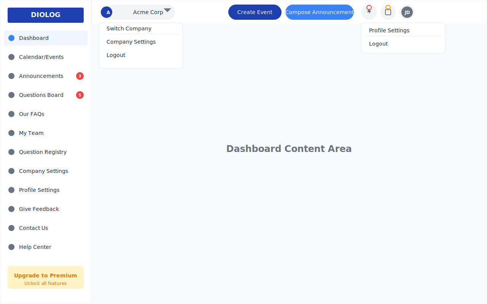

# Diolog Web Application - Navigation Wireframe

## Overview
This wireframe illustrates the navigation elements of the Diolog Web Application, including the sidebar navigation menu and top header navigation. These elements provide consistent access to all sections of the application and key user controls.

## Components

### Sidebar Navigation
- **Logo Area**: Prominently displays the Diolog logo at the top of the sidebar
- **Menu Items**: Provides access to all main sections of the application
  - Dashboard
  - Calendar/Events
  - Announcements (with notification badge)
  - Questions Board (with notification badge)
  - Our FAQs
  - My Team
  - Question Registry
  - Company Settings
  - Profile/Account Settings
  - Give Feedback
  - Contact Us
  - Help Center
- **Upgrade to Premium CTA**: Prominent call-to-action for users on the Freemium plan

### Top Header Navigation
- **Company Profile Dropdown**: Displays company logo and name with dropdown for:
  - Switch Company (for users with multiple company access)
  - Company Settings
  - Logout
- **Action Buttons**:
  - Create Event button
  - Compose Announcement button
- **Notifications Icon**: Bell icon with indicator for unread notifications
- **Upcoming Events Indicator**: Calendar icon with indicator for upcoming events
- **User Profile Dropdown**: User avatar with dropdown for:
  - Profile Settings
  - Logout

## Design Specifications

### Colors
- Primary Blue: #1E40AF (Diolog logo, Create Event button)
- Secondary Blue: #3B82F6 (Compose Announcement button, active menu icons)
- Background: #F9FAFB (main content area)
- Card/Header Background: #FFFFFF
- Text: #1F2937 (primary text)
- Light Text: #6B7280 (secondary text, icons)
- Border: #E5E7EB
- Notification Red: #EF4444 (notification badges)
- Warning/Premium CTA: #F59E0B, #FEF3C7 (Premium upgrade)

### Typography
- Font Family: Inter, sans-serif
- Logo: 18px bold
- Menu Items: 14px regular
- Dropdown Items: 14px regular/medium
- Button Text: 14px medium
- Notification Badges: 10px bold

### Layout
- Sidebar Width: 240px
- Header Height: 64px
- Menu Item Height: 40px
- Button Border Radius: 20px (pill shape)
- Dropdown Border Radius: 8px

## User Flow

1. **Sidebar Navigation**:
   - Users can click on any menu item to navigate to the corresponding section
   - Notification badges indicate the number of unread items
   - The currently active section is highlighted
   - Premium CTA is always visible for Freemium users

2. **Company Profile Dropdown**:
   - Users click on the company name/logo to open the dropdown
   - "Switch Company" allows users with multiple company access to change context
   - "Company Settings" navigates to the Company Settings page
   - "Logout" logs the user out of the application

3. **Action Buttons**:
   - "Create Event" opens the Event Creation form
   - "Compose Announcement" opens the Announcement Creation form

4. **Notifications Icon**:
   - Clicking opens a notifications panel showing recent notifications
   - Red indicator shows when there are unread notifications

5. **Upcoming Events Indicator**:
   - Clicking opens a small panel showing upcoming events
   - Orange indicator shows when there are events coming up soon

6. **User Profile Dropdown**:
   - Users click on their avatar to open the dropdown
   - "Profile Settings" navigates to the Profile/Account Settings page
   - "Logout" logs the user out of the application

## Accessibility Considerations
- All interactive elements are keyboard navigable
- Sufficient color contrast for text readability
- Notification badges include both color and number indicators
- Dropdown menus are properly labeled for screen readers

## Responsive Behavior
- On smaller screens, the sidebar can collapse to icons only
- On mobile devices, the sidebar becomes a hamburger menu
- Action buttons may collapse into a "+" menu on very small screens

## Latest Version

## Change Log

| Date | Description | Author |
|------|-------------|--------|
| 2023-11-01 | Initial creation of Navigation wireframe | AI-assisted design |
