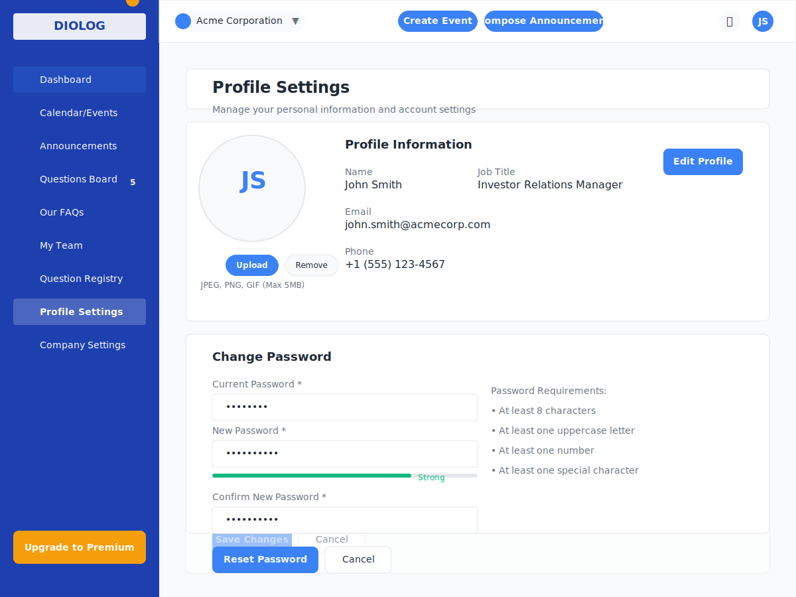

# Diolog Web Application - Profile/Account Settings Wireframe

## Overview
This document describes the Profile/Account Settings wireframe for the Diolog Web Application. The Profile/Account Settings page allows users to view and edit their personal profile information, upload a profile image, and manage their account settings including password reset functionality.

## Components

### Navigation Elements
1. **Sidebar Navigation**
   - Company logo/branding
   - Menu items with Profile/Account Settings highlighted as active
   - Notification badge showing outstanding questions in Questions Board
   - Upgrade to Premium CTA button (if applicable)

2. **Top Header**
   - Company profile dropdown
   - Notification icon
   - User profile dropdown (currently active)

### Profile/Account Settings Content

3. **Page Header**
   - "Profile Settings" title
   - Brief description of the page purpose

4. **Profile Information Section**
   - Profile image display with upload/change option
   - Current user information display
   - Edit Profile button

5. **Profile Image Upload**
   - Current profile image (or placeholder if none)
   - Upload button with drag-and-drop support
   - Remove image button
   - Supported file types and size information

6. **Edit Profile Form**
   - First Name field (required)
   - Last Name field (required)
   - Phone Number field (optional)
   - Job Title field (optional)
   - Form validation indicators
   - Save Changes and Cancel buttons

7. **Password Reset Section**
   - Section title "Change Password"
   - Old Password field (required)
   - New Password field (required) with password strength indicator
   - Confirm New Password field (required)
   - Password requirements information
   - Reset Password and Cancel buttons

8. **Confirmation Messages**
   - Success message for profile updates
   - Success message for password reset
   - Error messages for validation failures

## Design Notes

- **Layout**: Clean, card-based layout with clear section separation
- **Visual Hierarchy**: Important information and actions are prominently displayed
- **Form Design**: Intuitive form layout with clear labels and validation feedback
- **Responsive Design**: Layout adapts to different screen sizes while maintaining usability
- **Accessibility**: High contrast text, clear focus states, and screen reader support

## Interactions

- Clicking "Edit Profile" button reveals the edit profile form with pre-filled current values
- Clicking "Upload" button opens a file picker dialog or allows drag-and-drop
- Clicking "Remove" button removes the current profile image and reverts to a placeholder
- Form fields show validation feedback as the user types
- Clicking "Save Changes" in the Edit Profile form validates inputs and saves changes if valid
- Clicking "Reset Password" validates password inputs and updates the password if valid
- Clicking "Cancel" in either form discards changes and returns to the view state
- Success messages appear briefly after successful operations
- Error messages appear below invalid fields with specific guidance

## Changelog

| Date | Version | Description | Author |
|------|---------|-------------|--------|
| 2023-11-10 | 1.0 | Initial wireframe creation | AI-generated based on PRD requirements |

