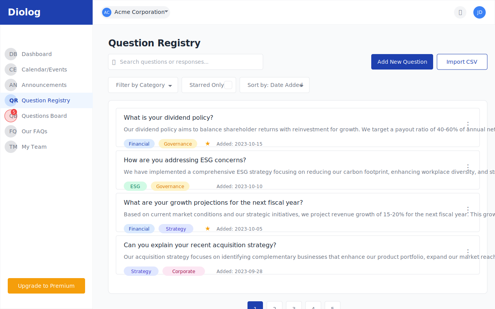

# Diolog Web Application - Question Registry Wireframe

## Overview
This document describes the Question Registry wireframe for the Diolog Web Application. The Question Registry provides a centralized repository for managing pre-approved question and response templates, allowing IR teams to maintain consistent messaging and efficiently respond to common investor inquiries.

## Components

### Navigation Elements
1. **Sidebar Navigation**
   - Company logo/branding
   - Menu items with Question Registry highlighted as active
   - Notification badge showing 5 outstanding questions in Questions Board
   - Upgrade to Premium CTA button

2. **Top Header**
   - Company profile dropdown
   - Notification icon
   - User profile dropdown

### Question Registry Content

3. **Page Header**
   - "Question Registry" title
   - Search bar for questions/responses
   - Add New Question button (primary action)
   - Import CSV button (secondary action)

4. **Filter and Sort Controls**
   - Filter by Category dropdown
   - Filter by Starred toggle
   - Sort by dropdown (Date Added, Last Edited, Alphabetical)

5. **Question Registry List**
   - Each question entry includes:
     - Question title/text
     - Response snippet
     - Category tags
     - Star/Favorite indicator
     - Date added/last edited
     - Actions menu (Edit, Delete, Star)

6. **Add New Question Form**
   - Question Title field (required)
   - Response field with rich text editor (required)
   - Category Tags multi-select
   - Star/Favorite checkbox
   - Save and Cancel buttons

7. **Edit Question Form**
   - Pre-filled with existing question data
   - Same fields as Add New Question form
   - Save Changes and Cancel buttons

8. **Delete Confirmation Dialog**
   - Warning message about deleting registry entry
   - Confirm Delete button
   - Cancel button

9. **CSV Import Interface**
   - File upload area with drag-and-drop support
   - Browse button
   - CSV format instructions/template download link
   - Import button
   - Cancel button

10. **Import Results Summary**
    - Success/error message
    - Number of questions successfully imported
    - Number of questions with errors
    - Details of errors (if any)
    - Done button

## Design Notes

- **List Layout**: Clean, card-based layout for question registry entries with consistent spacing and information hierarchy
- **Visual Indicators**: Star icon for favorite/important questions, color-coded category tags
- **Rich Text Editor**: Full-featured editor for response templates with formatting options
- **CSV Import**: User-friendly import process with clear feedback and error handling
- **Responsive Design**: Layout adapts to different screen sizes while maintaining usability

## Interactions

- Clicking "Add New Question" button opens the Add New Question form
- Clicking "Import CSV" button opens the CSV Import interface
- Clicking the search bar allows searching questions by keywords in question text or response content
- Clicking the Edit action opens the Edit Question form with pre-filled values
- Clicking the Delete action shows a confirmation dialog before deleting the entry
- Clicking the Star action toggles the favorite status of a question
- Clicking "Save" in the Add New Question form adds the question to the registry
- Clicking "Save Changes" in the Edit Question form updates the question in the registry
- Clicking "Import" in the CSV Import interface processes the uploaded file and shows results

## Changelog

| Date | Version | Description | Author |
|------|---------|-------------|--------|
| 2023-11-03 | 1.0 | Initial wireframe creation | AI-generated based on PRD requirements |

